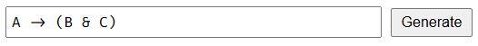
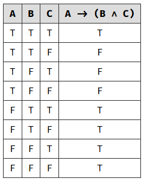
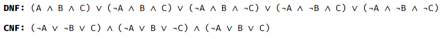

# Truth Table, CNF, and DNF Generator

This project is a web-based application that allows users to enter logical expressions and generate their corresponding truth tables, Conjunctive Normal Form (CNF), and Disjunctive Normal Form (DNF).

## Features

- Accepts logical expressions using standard symbols:
  - `~` for *NOT*
  - `&` for *AND*
  - `|` for *OR*
  - `->` for *IMPLIES*
  - `<->` for *EQUIVALENCE*
- Uses Fira Code font that allows ligatures to help show the symbols better.
- Parses the input expression and generates a truth table.
- Computes the Conjunctive Normal Form (CNF) and Disjunctive Normal Form (DNF) for the given expression.

## Usage
1. Open index.html in a browser.
2. Enter a logical expression in the input box.
3. Click the "Generate" button to compute and display the truth table, CNF, and DNF.
4. The results will be displayed below the input field.

### Example Input
```
A -> (B & C)
```
You'll see your input as such (with ligatures)



### Example Output





## Files

`index.html` - Main HTML file containing the UI structure.

`index.css` - Stylesheet for formatting the UI.

`index.js` - JavaScript logic for parsing expressions, generating truth tables, and computing CNF/DNF.

## Dependencies

This project does not require any external dependencies or frameworks. It uses plain HTML, CSS, and JavaScript.

## License

No specific license. You are free to use, modify, and distribute this project as you see fit.
